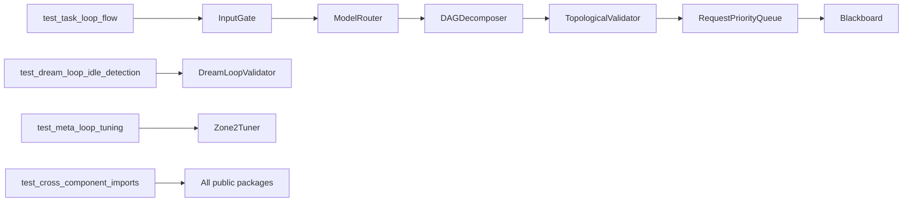

# Testing Strategy and Results

## Strategy

The project currently uses focused integration coverage in `tests/test_integration.py`. The test suite verifies that the main loop contracts compose across component packages and that all top-level component APIs import cleanly.



## Existing Tests

### `test_task_loop_flow`

Source: `tests/test_integration.py`

Validates the core Task Loop:

- `components/quality_harness.InputGate` accepts a request with `task_id` and `action_type`.
- `components/llm_scheduler.ModelRouter` routes complex work to a premium model.
- `components/dag_scheduler.DAGDecomposer` creates at least three nodes for an API/auth goal.
- `components/dag_scheduler.TopologicalValidator` accepts the generated DAG.
- `components/llm_scheduler.RequestPriorityQueue` returns high-priority work first.
- `components/blackboard.Blackboard` writes, checkpoints, and reads state.

### `test_dream_loop_idle_detection`

Source: `tests/test_integration.py`

Validates idle reflection triggers:

- Reflection is triggered when rounds without new nodes meet the threshold, inactivity exceeds 15 minutes, and no subagents are active.
- Reflection is blocked when any subagent remains active.

### `test_meta_loop_tuning`

Source: `tests/test_integration.py`

Validates Zone 2 tuning:

- Three consecutive low success rates trigger a raise to the quality gate threshold.
- Concurrent agents at the SLA limit reduce parallelism and increase serial dependency ratio.

### `test_cross_component_imports`

Source: `tests/test_integration.py`

Validates package-level API availability:

- Imports and initializes `SignalDetector`, `DreamLoopValidator`, `Zone2Tuner`, and `InputGate`.
- Verifies `ContextCompressor`, `BenchmarkRunner`, `OutputGate`, and `ToolGate` are importable.

## Recommended Additional Tests

The current integration tests cover the main happy paths. The highest-value next tests are contract and edge-case tests around state, validation, and retry decisions.

| Area | Recommended coverage |
| --- | --- |
| `TokenBucket` | Invalid `rate`, invalid `burst`, waiting behavior, and burst exhaustion. |
| `CheckpointManager` | Full reset clears incrementals; restore deep-merges ordered patches; missing full checkpoint raises. |
| `SignalDetector` | Separate tests for repeat, token anomaly, no progress, and heartbeat timeout. |
| `ToolGate` | Invalid `expected_schema["required"]` type raises `TypeError`; deviation log format. |
| `OutputGate` | Accept, retry, and human-review branches. |
| `TopologicalValidator` | Duplicate IDs, missing dependency, and cycle detection. |
| `DAGReplanner` | Preserved success results, affected downstream node replacement, invalid failed node. |
| `ContextCompressor` | Cadence, archive key, compression ratio, and retained trace lower bound. |
| `InstructionReinjector` | Cadence and payload content. |
| `DreamLoop` | L1 unverified without failed evidence, L1.5 insufficient agreement, L2 contested status. |
| `DecisionBenchmark` | Kappa/F1/ICC error paths and deterministic report dimensions. |
| `Zone2Tuner` | Token-budget model downgrade, compression frequency increase, manual-review escalation. |

## Running Tests

From the repository root:

```bash
pytest
```

To run the integration suite directly:

```bash
pytest tests/test_integration.py
```

## Documentation Verification

The requested documentation files are:

```text
docs/
  architecture.md
  components.md
  testing.md
```

Creation can be verified with:

```bash
ls -la docs/
```

