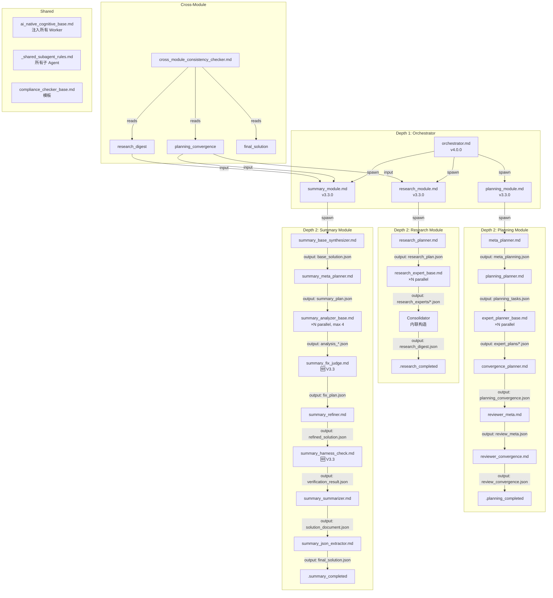

# Expert 1: Prompt 结构审计报告

> 审计日期：2026-07-29
> 审计范围：Solution Pro V3.3/V4.0 prompt 系统全量
> 审计方法：逐文件读取 + 依赖分析 + Registry 交叉验证 + 代码嵌入定量统计

---

## 1. 依赖关系图

### 1.1 整体架构（Mermaid）



### 1.2 信息流路径

```
frozen_spec.json
    │
    ▼
[Planning Pipeline]
    ├── meta_planner → meta_planning.json
    ├── planning_planner → planning_tasks.json
    ├── expert_planner_base ×N → expert_plans/*.json
    ├── convergence_planner → planning_convergence.json ◄── 关键产出
    ├── reviewer_meta → review_meta.json
    └── reviewer_convergence → review_convergence.json
            │
            ▼
[Research Pipeline]
    ├── research_planner → research_plan.json
    ├── research_expert_base ×N → research_experts/*.json
    └── Consolidator → research_digest.json ◄── 关键产出
            │
            ▼
[Summary Pipeline]
    ├── base_synthesizer → base_solution.json
    ├── summary_meta_planner → summary_plan.json
    ├── summary_analyzer_base ×N → analysis_*.json
    ├── summary_fix_judge → fix_plan.json
    ├── summary_refiner → refined_solution.json
    ├── summary_harness_check → verification_result.json
    ├── summary_summarizer → solution_document.json
    └── summary_json_extractor → final_solution.json ◄── 最终产出
```

### 1.3 隐式依赖识别

| 隐式依赖 | 描述 | 风险 |
|-----------|------|------|
| planning_convergence → research_module | Research module 读取 planning 的输出作为输入 | 中等：若 planning 格式变化，research 静默失败 |
| planning_convergence → summary_module | Summary 直接读取 planning 约束 | 高：两个模块各自独立读取，无版本校验 |
| research_digest → summary_module | Summary 读取 research 发现 | 中等：F-xxx ID 引用链断裂风险 |
| ai_native_cognitive_base → 所有 Worker | 认知基底注入，但实际注入路径不明确 | 高：README 说应注入但未在 4 个 module agent 中看到引用 |
| _shared_subagent_rules.md → 所有子 Agent | 共享规则，但未在 Worker spawn 的 task 中显式引用 | 中：rules 可能被部分 Worker 忽略 |

### 1.4 循环依赖检查

✅ **未发现循环依赖。** 管线是严格的单向 DAG：Planning → Research → Summary。

---

## 2. 信息流完整性分析

### 2.1 逐层传递检查

| 层级 | 传递项 | 状态 | 说明 |
|------|--------|------|------|
| Orchestrator → Planning Module | `{session_id}`, `{deepflow_root}` | ✅ 完整 | 通过 render_prompt 注入 |
| Orchestrator → Research Module | `{session_id}`, `{deepflow_root}` | ✅ 完整 | 通过 render_prompt 注入 |
| Orchestrator → Summary Module | `{session_id}`, `{deepflow_root}` | ✅ 完整 | 通过 render_prompt 注入 |
| Planning Module → Workers | `{session_id}`, `{deepflow_root}`, prompt 路径 | ✅ 完整 | 通过 task 参数传递 |
| Research Module → Workers | `{session_id}`, `{deepflow_root}`, prompt 路径 | ✅ 完整 | 通过 task 参数传递 |
| Summary Module → Workers | `{session_id}`, `{deepflow_root}`, prompt 路径 | ✅ 完整 | 通过 task 参数传递 |
| Cross-module: planning → research | `planning_convergence.json` | ⚠️ 隐式 | Research 不显式声明依赖版本 |
| Cross-module: planning → summary | `planning_convergence.json` | ⚠️ 隐式 | 同上 |
| Cross-module: research → summary | `research_digest.json` | ⚠️ 隐式 | Summary 通过 F-xxx ID 引用，断裂风险 |

### 2.2 信息断裂点识别

| # | 断裂点 | 严重度 | 说明 |
|----|--------|--------|------|
| 1 | **Planning 约束到 Research 的传递** | P1 | Research 模块的 coverage_map 需覆盖所有 UC-xxx，但无自动校验机制 |
| 2 | **Research F-xxx ID 到 Summary 的引用链** | P1 | Summary 按 F-xxx ID 引用 findings，但无 ID 一致性校验 |
| 3 | **Harness Check FAIL 信号传递** | P2 | 二次 FAIL 后写 `harness_fail_signal.json`，但域级 adversarial reviewer 是否真正读取不明确 |
| 4 | **cognitive_base 注入路径** | P2 | ai_native_cognitive_base.md 的 README 说应注入到所有 Worker System Prompt 开头，但 4 个 module agent 的 task 中没有引用 |
| 5 | **_shared_subagent_rules 引用** | P2 | 该文件未在 module agent 的 spawn task 中显式引用，依赖于 Worker 自己的行为 |

### 2.3 变量注入覆盖检查

**变量声明（registry.yaml）**：所有 solution_pro 的 prompt 均声明 `required: []` 和 `optional: []`。

**实际情况**：所有 4 个 module agent 文件均使用 `render_prompt()` 注入 `{session_id}` 和 `{deepflow_root}`：

| 变量 | 使用位置 | 声明状态 |
|------|----------|----------|
| `{session_id}` | orchestrator, planning_module, research_module, summary_module, cross_module_consistency_checker | ❌ 未在 registry 声明 |
| `{deepflow_root}` | orchestrator, planning_module, research_module, summary_module, cross_module_consistency_checker | ❌ 未在 registry 声明 |
| `{current_module}` | orchestrator（循环中动态替换） | ❌ 未在 registry 声明 |
| `{run_id}` | planning_module, research_module, summary_module（task 中传递） | ❌ 未在 registry 声明 |
| `{checker_id}` | compliance_checker_base.md 模板 | ❌ 未在 registry 声明 |
| `{expert_name}` | expert_planner_base.md（通过 render_prompt 注入） | ❌ 未在 registry 声明 |

**结论**：registry.yaml 的变量声明与实际使用**完全脱节**。所有 prompt 的 `required`/`optional` 字段均为空，但实际使用了 2-6 个变量。

### 2.4 "注入但不消费"的变量

未发现明显注入但不消费的变量。所有注入的变量（`session_id`, `deepflow_root`）均在 prompt 代码中被消费。

---

## 3. 职责边界分析

### 3.1 职责清晰度矩阵

| Prompt | 角色 | 职责清晰度 | 重叠风险 |
|--------|------|-----------|----------|
| orchestrator.md | 薄层调度器 | ✅ 清晰 | 无 |
| planning_module.md | Planning 编排器 | ✅ 清晰 | 与 orchestrator 有"轮询等待"职责重叠 |
| research_module.md | Research 编排器 | ✅ 清晰 | 与 orchestrator 有"轮询等待"职责重叠 |
| summary_module.md | Summary 编排器 | ✅ 清晰 | 与 orchestrator 有"轮询等待"职责重叠 |
| meta_planner.md | Meta 规划 | ✅ 清晰 | 无 |
| planning_planner.md | 任务分解 | ✅ 清晰 | 无 |
| expert_planner_base.md | 专家规划 | ✅ 清晰 | 无 |
| convergence_planner.md | 收敛合并 | ✅ 清晰 | 无 |
| reviewer_meta.md | Meta 审查 | ⚠️ 模糊 | 与 reviewer_convergence 职责边界不清晰 |
| reviewer_convergence.md | 收敛审查 | ⚠️ 模糊 | 与 reviewer_meta 职责边界不清晰 |
| research_planner.md | 研究规划 | ✅ 清晰 | 无 |
| research_expert_base.md | 研究执行 | ✅ 清晰 | 无 |
| summary_base_synthesizer.md | 初稿合成 | ✅ 清晰 | 无 |
| summary_meta_planner.md | 分析规划 | ✅ 清晰 | 无 |
| summary_analyzer_base.md | 多角度分析 | ✅ 清晰 | 无 |
| summary_fix_judge.md | 修复裁判 | ✅ 清晰 | 与 summary_refiner 职责分离清晰 |
| summary_refiner.md | 定向修复 | ✅ 清晰 | 无 |
| summary_harness_check.md | 独立终检 | ✅ 清晰 | 无 |
| summary_summarizer.md | 文档生成 | ✅ 清晰 | 无 |
| summary_json_extractor.md | 结构化提取 | ✅ 清晰 | 无 |
| cross_module_consistency_checker.md | 跨模块一致性 | ✅ 清晰 | 与 summary_harness_check 有检查维度重叠 |
| adversarial_quality_reviewer.md | 对抗性质量审查 | ⚠️ 模糊 | 与 harness_check 和 consistency_checker 的职责边界需明确定义 |
| solution_pulse.md | 脉冲调度器 | ⚠️ 特殊 | 独立于主管线，cron 触发，职责不同于 orchestrator |
| planning_expert_base.md | 规划专家基类 | ⚠️ 模糊 | 与 expert_planner_base.md 名称相似，职责需区分 |
| review_layer_b.md | 审查层 B | ⚠️ 模糊 | 与 reviewer_convergence 关系不明 |

### 3.2 职责重叠分析

| 重叠对 | 重叠程度 | 说明 |
|--------|----------|------|
| reviewer_meta vs reviewer_convergence | 中 | 两者都是审查角色，输出分属 review_meta.json 和 review_convergence.json，但审查维度是否互补无文档说明 |
| summary_harness_check vs cross_module_consistency_checker | 低-中 | 前者检查单模块内部质量，后者检查跨模块数据流，但两者都检查"约束覆盖" |
| adversarial_quality_reviewer vs summary_harness_check | 中 | 两者都做质量审查，前者是"域级 adversarial"，后者是模块内终检，但触发条件和检查维度边界不清晰 |
| orchestrator 轮询 vs module agent 轮询 | 低 | Orchestrator 在 Step 1c 轮询，module agent 在各自内部也有 wait_for 轮询。这是两级等待机制，设计合理但需注意 timeout 叠加 |

### 3.3 冗余 Prompt 识别

| # | 文件 | 状态 | 建议 |
|----|------|------|------|
| 1 | `_archive/devil_advocate.md` | 已归档 | 确认无需恢复后可删除 registry 条目 |
| 2 | `_archive/gap_analyst.md` | 已归档 | 确认无需恢复后可删除 registry 条目 |
| 3 | `_archive/reviewqc_module.md` | 已归档 | 确认无需恢复后可删除 registry 条目 |
| 4 | `_archive/harness_legacy/*` (10 个文件) | 已归档 | 所有 harness 文件已移至 `_archive/harness_legacy/`，但 registry 中仍有条目 |
| 5 | `_archive/harness_legacy/summary_fix_judge.md` | 重复 | 主目录有 V1.0.0 版本，_archive 有旧版本 |
| 6 | `_archive/harness_legacy/summary_fix_agent.md` | 已废弃 | 仅存在于 _archive，V3.3 中已被 summary_fix_judge 替代 |

### 3.4 职责缺失

| # | 缺失项 | 严重度 | 说明 |
|----|--------|--------|------|
| 1 | **Planning → Research 版本校验** | P1 | 没有 prompt 负责验证 research 使用的 planning_convergence 版本是否匹配 |
| 2 | **Research → Summary ID 校验** | P1 | 没有 prompt 验证 Summary 的 F-xxx 引用是否在 research_digest 中存在 |
| 3 | **research_expert_base 的 prompt 注入** | P2 | research_module.md 中 Step 2.1 的 prompt 生成代码似乎有 bug（`prompt + ctx` 但 `prompt` 来源不明确） |
| 4 | **Orchestrator V4.0 的 reviewer 步骤** | P2 | orchestrator.md V4.0 明确说"移除 Step 4 后置验证"，但 planning_module.md 仍包含 reviewer_meta 和 reviewer_convergence 步骤 |

---

## 4. Registry 准确性报告

### 4.1 总体统计

| 指标 | 数值 |
|------|------|
| Registry 中 solution_pro 条目 | 41 |
| 磁盘上实际 .md 文件（主目录） | 30 |
| 磁盘上 _archive 目录文件 | 13 |
| 完全匹配 | 26 |
| Registry 有但文件在主目录不存在 | 14 |
| 文件在主目录存在但 Registry 无 | 4 |
| Registry 文件在 _archive 中 | 12 |

### 4.2 Registry 有但文件不存在（主目录）

| Registry Key | Filename | 实际位置 | 建议 |
|-------------|----------|----------|------|
| `auditor_harness` | auditor_harness.md | `_archive/harness_legacy/` | 从 registry 删除或标记 `status: deprecated` |
| `consolidator_harness` | consolidator_harness.md | `_archive/harness_legacy/` | 同上 |
| `fixer_expert_harness` | fixer_expert_harness.md | `_archive/harness_legacy/` | 同上 |
| `fixer_harness` | fixer_harness.md | `_archive/harness_legacy/` | 同上 |
| `planner_harness` | planner_harness.md | `_archive/harness_legacy/` | 同上 |
| `researcher_harness` | researcher_harness.md | `_archive/harness_legacy/` | 同上 |
| `reviewer_harness` | reviewer_harness.md | `_archive/harness_legacy/` | 同上 |
| `summarizer_harness` | summarizer_harness.md | `_archive/harness_legacy/` | 同上 |
| `summary_fix_agent` | summary_fix_agent.md | `_archive/harness_legacy/` | 从 registry 删除 |
| `devil_advocate` | devil_advocate.md | `_archive/` | 从 registry 删除或标记 deprecated |
| `gap_analyst` | gap_analyst.md | `_archive/` | 同上 |
| `reviewqc_module` | reviewqc_module.md | `_archive/` | 同上 |
| **`harness_agent`** | harness_agent.md | **不存在！** | 🔴 严重：registry 引用了不存在的文件 |

### 4.3 文件存在但 Registry 无

| 文件 | 版本 | 角色 | 建议 |
|------|------|------|------|
| `adversarial_quality_reviewer.md` | 3.3.0 | 域级对抗审查 | 添加到 registry |
| `solution_pulse.md` | 无版本号 | 脉冲调度器 | 添加到 registry |
| `planning_expert_base.md` | 3.3.0 | 规划专家 | 添加到 registry |
| `_shared_subagent_rules.md` | 无版本号 | 共享规则 | 可选：添加到 registry 或标记为共享资源 |
| `cross_module_consistency_checker.md` | 1.0.0 | 跨模块一致性 | 添加到 registry |
| `summary_fix_judge.md` (主目录版本) | 1.0.0 | 修复裁判 | 已注册但 registry 中 filename 可能指向旧版本 |

### 4.4 README.md 准确性

| 指标 | 结果 |
|------|------|
| README 列出文件数 | 24（含 `v1/` 目录引用） |
| 实际主目录文件数 | 30 |
| README 有但文件不存在 | `harness_agent.md` |
| 文件存在但 README 无 | `adversarial_quality_reviewer.md`, `solution_pulse.md`, `planning_expert_base.md`, `summary_fix_judge.md`, `cross_module_consistency_checker.md`, `_shared_subagent_rules.md`, `review_layer_b.md` |

### 4.5 版本号一致性

🔴 **严重不一致**：Registry 中所有 solution_pro prompt 的 version 均为 `"2.0.0"`，但实际文件版本：

| 文件 | Registry Version | 实际 Version | 差异 |
|------|-----------------|-------------|------|
| orchestrator.md | 2.0.0 | **4.0.0** | +2 major |
| planning_module.md | 2.0.0 | **3.3.0** | +1 major |
| research_module.md | 2.0.0 | **3.3.0** | +1 major |
| summary_module.md | 2.0.0 | **3.3.0** | +1 major |
| summary_fix_judge.md | 2.0.0 | **1.0.0** | -1 major |
| summary_harness_check.md | 2.0.0 | **1.0.0** | -1 major |
| cross_module_consistency_checker.md | N/A | **1.0.0** | 未注册 |
| 其余所有 | 2.0.0 | **3.3.0** | +1 major |

**此外**：registry 的 `last_updated` 为 `2026-07-06T00:44:15+08:00`，但多个文件的实际更新日期为 `2026-07-26` 和 `2026-07-27`。所有 changelog 条目均为 `"Auto-registered from disk (contract cage fix)"`，无实际变更记录。

---

## 5. 代码嵌入比例统计

### 5.1 四大 Module Agent 代码嵌入比例

| 文件 | 总字节 | 代码字节 | 代码比例 | 评估 |
|------|--------|----------|----------|------|
| orchestrator.md | 9,436 B | 5,572 B | **59.1%** | ⚠️ 代码过半 |
| planning_module.md | 21,669 B | 13,917 B | **64.2%** | 🔴 代码占主导 |
| research_module.md | 18,546 B | 8,532 B | **46.0%** | ⚠️ 接近半数 |
| summary_module.md | 28,580 B | 21,988 B | **76.9%** | 🔴 严重代码为主 |

**平均代码嵌入比例**：**61.6%**

### 5.2 Worker Prompt 代码嵌入比例（估算）

| 文件 | 行数 | 代码比例（估算） | 类型 |
|------|------|-----------------|------|
| summary_json_extractor.md | 443 | ~15% | 轻量代码 |
| summary_review_layer_b.md | 384 | ~10% | 纯 prompt |
| summary_summarizer.md | 333 | ~10% | 纯 prompt |
| summary_meta_planner.md | 292 | ~10% | 纯 prompt |
| summary_base_synthesizer.md | 216 | ~10% | 纯 prompt |
| summary_harness_check.md | 211 | ~10% | 纯 prompt |
| research_planner.md | 209 | ~10% | 纯 prompt |
| research_expert_base.md | 199 | ~10% | 纯 prompt |
| summary_fix_judge.md | 187 | ~10% | 纯 prompt |
| summary_analyzer_base.md | 172 | ~10% | 纯 prompt |
| summary_refiner.md | 172 | ~10% | 纯 prompt |
| planning_planner.md | 164 | ~10% | 纯 prompt |
| convergence_planner.md | 未知 | ~10% | 纯 prompt |
| expert_planner_base.md | 未知 | ~10% | 纯 prompt |
| meta_planner.md | 未知 | ~10% | 纯 prompt |

### 5.3 分析结论

**关键发现**：存在明显的"两层分化"现象：

1. **Module Agent 层（4 个文件）**：代码嵌入比例 46%-77%，平均 61.6%。这些文件本质上是**编排脚本**，不是 prompt。
2. **Worker 层（15+ 个文件）**：代码嵌入比例 ~10-15%，以自然语言指令为主，是真正的 prompt。

**影响**：Module Agent 层的"prompt"被海量 Python 代码淹没。agent 在执行时，真正的指令（如"V4.0 核心变更"、"生存铁律"）仅占 23-54% 的内容，容易被代码噪音干扰。

---

## 6. 核心发现 + 改进建议

### P0（阻塞级 — 立即修复）

| # | 发现 | 建议 |
|----|------|------|
| P0-1 | **`harness_agent.md` 在 registry 中注册但文件不存在** | 立即确认该文件是否应存在，如已废弃则从 registry 和 README 中删除 |
| P0-2 | **Registry 版本号全量错误**（全部标记为 2.0.0，实际为 1.0.0~4.0.0） | 同步 registry.yaml 的版本号到实际文件，更新 `last_updated` 时间戳 |
| P0-3 | **Orchestrator V4.0 与 Planning Module V3.3 架构不一致**：Orchestrator 说"移除 Step 4 后置验证"，但 planning_module 仍包含 reviewer_meta 和 reviewer_convergence 步骤 | 对齐两个版本：要么在 planning_module 中移除 reviewer 步骤，要么在 orchestrator 中恢复验证步骤 |

### P1（高优先级 — 本迭代修复）

| # | 发现 | 建议 |
|----|------|------|
| P1-1 | **Registry 变量声明全空**：所有 prompt 的 `required`/`optional` 均为空列表，但实际使用了 `session_id`、`deepflow_root`、`current_module`、`run_id` 等变量 | 为每个 prompt 补全变量声明，至少添加 `session_id` 和 `deepflow_root` 为 required |
| P1-2 | **14 个已归档文件仍在 registry 中** | 清理 registry，删除已归档文件的条目或标记 `status: deprecated` |
| P1-3 | **6 个文件存在但未在 registry 注册**（adversarial_quality_reviewer, solution_pulse, planning_expert_base, _shared_subagent_rules, cross_module_consistency_checker, summary_fix_judge 主目录版本） | 添加到 registry，指定正确的 version 和 role |
| P1-4 | **Research Module Step 2.1 代码疑似 bug**：`prompt + ctx` 但 `prompt` 并非 `base_prompt` 的赋值结果，而是直接引用了未定义的变量 | 审查并修复 research_module.md 中 Step 2.1 的 prompt 生成逻辑 |
| P1-5 | **跨模块依赖无版本校验**：planning → research → summary 的数据传递基于文件约定，无 Schema 版本校验 | 在每个阶段输出中增加 `schema_version` 字段，下游模块读取时校验 |

### P2（中优先级 — 下迭代修复）

| # | 发现 | 建议 |
|----|------|------|
| P2-1 | **代码嵌入比例过高**：4 个 Module Agent 的代码占比 46%-77%，平均 61.6% | 考虑将 Module Agent 的编排逻辑从 .md 文件迁移到 Python 模块，prompt 文件只保留纯指令 |
| P2-2 | **ai_native_cognitive_base 注入路径不明确**：README 说应注入到所有 Worker System Prompt，但 4 个 module agent 的 task 中未见引用 | 在 render_prompt 或 task 构建时显式注入 cognitive_base |
| P2-3 | **_shared_subagent_rules 未显式引用**：该文件定义了子 Agent 的行为契约，但各 module agent 的 spawn task 中未指示 Worker 读取该文件 | 在 task 中增加 `read {deepflow_root}/domains/solution_pro/prompts/_shared_subagent_rules.md` 指令 |
| P2-4 | **README.md 与实际文件不同步**：7 个文件缺失，1 个幽灵文件（harness_agent） | 更新 README.md 以反映实际文件列表 |
| P2-5 | **adversarial_quality_reviewer 与 harness_check 的职责边界模糊** | 文档化两者的触发条件、检查维度、输出格式差异 |
| P2-6 | **reviewer_meta 与 reviewer_convergence 职责边界模糊** | 在两个 prompt 中明确各自的审查维度和互补关系 |
| P2-7 | **Registry changelog 全为 "Auto-registered from disk"** | 补全真实的 changelog 记录，或标记为 "auto-generated, pending manual review" |

---

## 7. 整体评分

### 评分：**C+**

### 评分理由

**优点**：
- ✅ 依赖关系清晰：严格单向 DAG，无循环依赖
- ✅ 信息流路径完整：从 frozen_spec → Planning → Research → Summary → final_solution 的链路完整
- ✅ 模块职责基本清晰：Orchestrator/Module/Worker 三层分离明确
- ✅ Worker 层 prompt 质量高：纯指令为主，代码嵌入率低（~10-15%）
- ✅ 归档机制存在：`_archive/` 目录用于管理废弃文件

**缺点**：
- 🔴 **Registry 全面失准**：版本号全错、变量声明全空、changelog 无实际内容、14 个幽灵条目
- 🔴 **关键文件缺失**：harness_agent.md 在 registry 中注册但磁盘上不存在
- 🔴 **架构版本不一致**：Orchestrator V4.0 与 Planning Module V3.3 的步骤描述矛盾
- ⚠️ **Module Agent 层代码占比过高**（61.6%），prompt 指令被代码淹没
- ⚠️ **README 与实际文件不同步**
- ⚠️ **跨模块数据流无版本校验机制**
- ⚠️ **共享资源注入路径不明确**（cognitive_base, shared_rules）

**不评 D 的理由**：核心管线逻辑完整可用，依赖关系正确，Worker 层质量高。问题集中在 Registry 管理和文档同步，属于"能跑但不好维护"的状态。

**不评 B 的理由**：Registry 失准属于结构性缺陷，P0 级别的版本不一致和 harpness_agent 缺失问题需要立即修复才能保证系统可靠性。

---

## 附录：完整文件清单

### 主目录文件（30 个 .md）

```
orchestrator.md                 (v4.0.0)  P0-3 版本不一致
planning_module.md              (v3.3.0)
research_module.md              (v3.3.0)
summary_module.md               (v3.3.0)
meta_planner.md                 (v3.3.0)
planning_planner.md             (v3.3.0)
expert_planner_base.md          (v3.3.0)
convergence_planner.md          (v3.3.0)
reviewer_meta.md                (v3.3.0)
reviewer_convergence.md         (v3.3.0)
review_layer_b.md               (v3.3.0)
research_planner.md             (v3.3.0)
research_expert_base.md         (v3.3.0)
summary_base_synthesizer.md     (v3.3.0)
summary_meta_planner.md         (v3.3.0)
summary_analyzer_base.md        (v3.3.0)
summary_fix_judge.md            (v1.0.0)  🆕 V3.3
summary_refiner.md              (v3.3.0)
summary_harness_check.md        (v1.0.0)  🆕 V3.3
summary_summarizer.md           (v3.3.0)
summary_json_extractor.md       (v3.3.0)
summary_review_layer_b.md       (v3.3.0)
adversarial_quality_reviewer.md (v3.3.0)  ❌ 未在 registry
solution_pulse.md               (无版本)   ❌ 未在 registry
planning_expert_base.md         (v3.3.0)  ❌ 未在 registry
cross_module_consistency_checker.md (v1.0.0) ❌ 未在 registry
ai_native_cognitive_base.md     (v3.3.0)
compliance_checker_base.md      (无版本号)
_shared_subagent_rules.md       (无版本号)
README.md
```

### _archive/ 目录文件（13 个 .md）

```
devil_advocate.md               ❌ registry 中仍有条目
gap_analyst.md                  ❌ registry 中仍有条目
reviewqc_module.md              ❌ registry 中仍有条目
harness_legacy/
  ├── auditor_harness.md        ❌ registry 中仍有条目
  ├── consolidator_harness.md   ❌ registry 中仍有条目
  ├── fixer_expert_harness.md   ❌ registry 中仍有条目
  ├── fixer_harness.md          ❌ registry 中仍有条目
  ├── planner_harness.md        ❌ registry 中仍有条目
  ├── researcher_harness.md     ❌ registry 中仍有条目
  ├── reviewer_harness.md       ❌ registry 中仍有条目
  ├── summarizer_harness.md     ❌ registry 中仍有条目
  ├── summary_fix_agent.md      ❌ registry 中仍有条目
  └── summary_fix_judge.md      (旧版本，主目录有 v1.0.0)
```